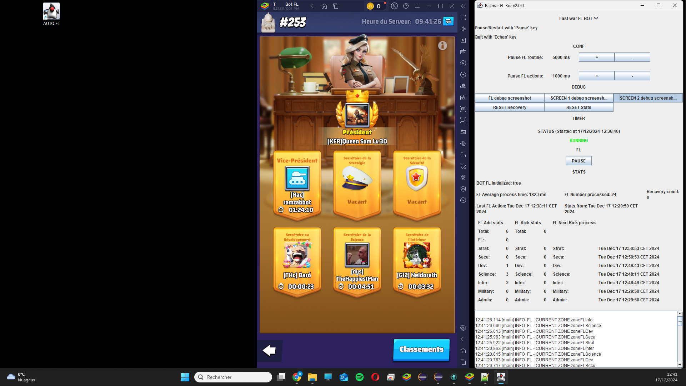
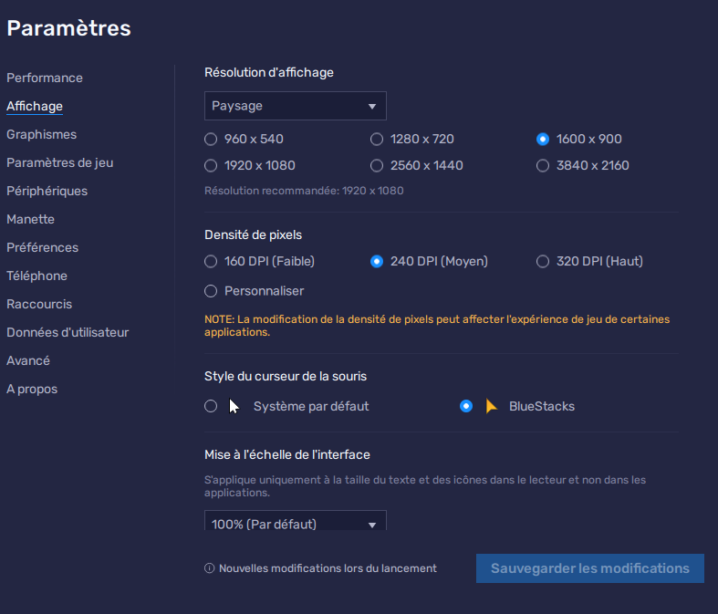

# lastWarAutoFL
A bot for automatic First Lady job in the Last War mobile game
- Auto kick after 10 minutes (kicks screens are saved)
- Customizable delay between a first lady routine
- Customizable delay between actions (clicks)
- Automatic recovery in case of Bluestacks crash.
- Multiple stats: number of additions or kicks per title.
- Manage 6 buffs (normal case) 8 buffs when you win or when you loose the capitol
- Manage the case of full list (50/50) and the priority
- Automatic Bluestack start when launching program
- Automatic Bluestack restart when FL did nothing during 10 minutes 

# Installation
- Have a 1080p screen and bluestack using the max height size 
  
- Use these parameters  
  
- Replace in pom.xml `todir="C:/sandbox/LastWar Auto FL"` with a correct path to your workstation
- Replace in ProcessManager.java `private static String BOT_FL_PROCESS = "C:\\Program Files\\BlueStacks_nxt\\HD-Player.exe\" --instance Pie64_4 --cmd launchAppWithBsx --package \"com.fun.lastwar.gp\" --source desktop_shortcut";` with your current Bluestack instance.  
      
> You can create a shortcut to have this information:    

- Name your Bluestack instance starting with "T   " (Or replace `/lastWarAutoFL/src/main/resources/images/init/bluestack_fl.png`)
- `mvn clean install`
- Launch the executable JAR `lastWarAutoFl-2.0.1.jar` in `C:/sandbox/LastWar Auto FL`

# Issues
If nothing happen, run as admin.   
Switch nvidia graphics setting from windows colours to nvidia colour scheme
